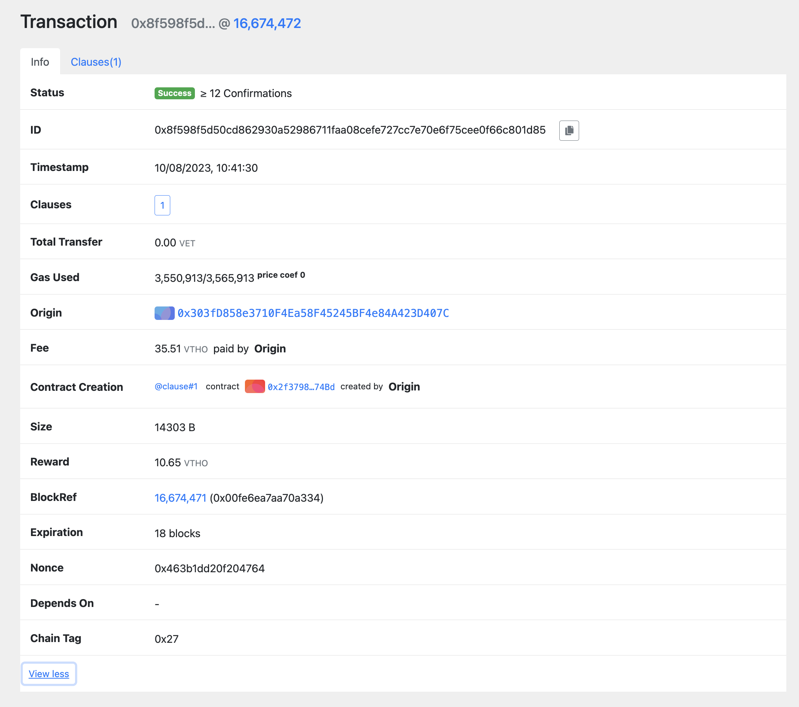

## ComplyTech

"ComplyTech," is developing a blockchain solution to help healthcare facilities earn rewards for proper medical waste disposal, using VechainThor tokens to redeem taxes and support society.

**Team:** [Anusha Reddy](https://github.com/anushareddy5/) [Rohith Reddy Kota](https://github.com/rohithreddykota)

## Find In Vechain Explorer

[In Vechain Explorer - Testnet](https://explore-testnet.vechain.org/transactions/0x8f598f5d50cd862930a52986711faa08cefe727cc7e70e6f75cee0f66c801d85#info)

## What it does:

"ComplyTech" is a platform that streamlines and incentivizes the proper incineration of medical waste. It encompasses a range of features and functionalities:

1. Medical Waste Tracking: The platform employs the VechainThor blockchain to create an immutable ledger of medical waste generation, collection, transportation, and incineration. This ensures complete transparency and traceability throughout the waste disposal process.

2. Compliance Monitoring: Smart contracts on the VechainThor blockchain are used to define and enforce compliance criteria. Healthcare facilities and individuals must adhere to these criteria to earn rewards in the form of Vechain tokens.

3. Vechain Token Rewards: Participants in the ecosystem, including hospitals, clinics, waste management companies, and individuals, are rewarded with Vechain tokens for compliant waste disposal. These tokens are earned based on the quantity and quality of waste disposal, as verified by the blockchain.

4. Tax Redemption: The Vechain tokens earned can be used as digital vouchers to offset taxes, thus reducing the financial burden on healthcare institutions. This mechanism encourages compliance and responsible waste management.

## Problems It Solves

"ComplyTech" addresses several critical issues:

1. Medical Waste Mismanagement: It tackles the problem of improper medical waste disposal, which can lead to environmental pollution, health hazards, and legal consequences.

2. Accountability: The platform ensures that all stakeholders in the waste disposal process are held accountable for their actions, reducing the likelihood of negligence.

3. Incentivizing Compliance: By offering Vechain tokens as rewards, the project motivates healthcare facilities and individuals to adhere to proper waste disposal protocols, fostering a culture of compliance.

4. Resource Allocation: It optimizes resource allocation by directing tax benefits to those who contribute positively to society through compliant waste disposal.

## How Vechain Is Used And Why Vechain

VechainThor blockchain technology plays a pivotal role in the project:

Smart Contracts: Smart contracts automate the verification of compliance criteria and the distribution of Vechain tokens, reducing administrative overhead. 

Tokenization: Vechain tokens serve as a valuable incentive, aligning the interests of healthcare institutions, waste management entities, and individuals with responsible waste disposal practices.

Transparency: The transparent nature of VechainThor enables all stakeholders to access real-time information about waste disposal, enhancing accountability.

## Aspects of Vechain Used In The Project

1. Blockchain Infrastructure: The VechainThor blockchain serves as the foundational infrastructure for the entire project. It provides a secure, decentralized ledger for recording all transactions and activities related to medical waste disposal and token rewards.

2. Smart Contracts: Smart contracts on the VechainThor blockchain are used to define and automate the rules and processes governing waste disposal compliance and token distribution. These contracts ensure transparent and immutable execution of actions.

3. Token Standard (Vechain Token): VechainThor supports the creation and management of custom tokens. The project uses Vechain's token standard to mint ERC20 tokens that represent the value of compliant waste disposal. These tokens can be distributed to desposers as rewards.

4. Connex Integration: Connex is a JavaScript library provided by Vechain that simplifies interactions with the VechainThor blockchain. The project integrates Connex to facilitate seamless communication with the blockchain, including sending transactions, querying data, and interacting with smart contracts.

5. Traceability and Immunity: VechainThor's traceability features are leveraged to track the entire lifecycle of medical waste, from generation to incineration. This ensures that all actions are recorded on the blockchain, providing transparency and immunity from tampering.

6. VechainThor Cryptocurrency (Thor): While not explicitly mentioned in the project description, Thor is the native cryptocurrency of the VechainThor blockchain. It may be used to pay for transaction fees incurred during interactions with the blockchain, such as deploying smart contracts or minting tokens.

7. Security and Consensus: VechainThor employs a Proof of Authority (PoA) consensus mechanism, which enhances security and scalability. This ensures that the project's data and smart contracts are secure and reliable.

## How The Problem Can Be Solved Using Vechain

1. Desposer Adds Items to the Disposal Portal:

- The process begins when a healthcare facility or individual, referred to as the "desposer," logs into the "Comply And Earn" platform.
- The desposer adds the items that need to be disposed of, such as medical waste, to the disposal portal. This action initiates the tracking process.

2. Schedules Collection Date with Collector:

- After adding items to the disposal portal, the desposer schedules a collection date with a designated waste collector. The collector is responsible for transporting the waste to an incineration facility.

3. Waste Collection and Incineration:

- On the scheduled collection date, the waste collector arrives at the desposer's location to pick up the medical waste.
- The waste collector ensures the safe transportation of the waste to an authorized incineration facility, where it will be safely disposed of through incineration.

4. Minting ERC20 Tokens:

- At the incineration facility, the waste is incinerated in compliance with environmental and safety regulations.
- Once the incineration process is complete and verified, ERC20 tokens are minted on the VechainThor blockchain. These tokens represent the value of the compliant waste disposal.

5. Token Distribution to Desposer:

- The ERC20 tokens minted as a result of compliant waste disposal are distributed to the desposer's wallet on the "Comply And Earn" platform.
- The number of tokens earned is determined by factors such as the quantity and quality of waste disposed of, all of which are tracked and recorded on the blockchain.

6. Token Usage During Taxation:

The desposer can then use these tokens as digital vouchers when it's time for taxation.
The tokens serve as a valuable asset that can offset taxes owed, providing financial relief to the desposer while also incentivizing proper waste disposal practices.

## Link To Slides

[Slides](https://www.canva.com/design/DAFwr9cqUnU/IyCfDP9tzkHrSPaMxgG0ow/edit?referrer=slideshows-landing-page)

## Important Docs

- [VechainThorKit](https://docs.vechain.org/developer-resources/sdks-and-providers/thor-devkit)
- [Connex](https://docs.vechain.org/developer-resources/sdks-and-providers/connex)
- [Web3-providers-connex](https://docs.vechain.org/developer-resources/sdks-and-providers/web3-providers-connex)
